# 🚧 RoadGuard AI: Road Damage Reporting & Municipal Triage Platform
### Hackathon Architecture v2.0 &bull; Unified Full-Stack MVP

RoadGuard AI is a unified, real-time civic infrastructure platform that bridges **Citizen Road Hazard Reporting** with **Municipal Emergency Dispatch**. The system combines edge computer vision, automated priority score calculation, and real-time geospatial triage mapping.

---

## 🏗️ System Workflow Architecture

```mermaid
flowchart LR
    A["📱 Citizen Web UI<br/>(Camera Capture + GPS Auto-Pin)"] -->|"POST /api/v1/analyze"| B["⚡ FastAPI Core Engine"]
    B -->|"Inference & BBox"| C["🧠 YOLOv8 & CV Pipeline<br/>(Pothole, Crack, Wear, Edge)"]
    C -->|"Defect Metrics"| D["⚖️ Priority Engine<br/>f(Severity, Conf, Road Class)"]
    D -->|"Media + Record"| E["🗄️ Supabase PostgreSQL<br/>+ Storage Bucket"]
    E -->|"Live Realtime Feeds"| F["🗺️ Authority Admin Dashboard<br/>(Geospatial Triage Queue)"]
    F -->|"Status Transition"| G["🚜 Municipal Dispatch Crews<br/>(Reported ➔ Assigned ➔ Resolved)"]
```



---

## ⚡ Direct Boot Commands (One-Click Launch)

### Option 1: Using the Automated Startup Script
```bash
cd /Users/rsaipranav/.gemini/antigravity/scratch/road-damage-platform
./start.sh
```

### Option 2: Manual Terminal Execution
```bash
cd /Users/rsaipranav/.gemini/antigravity/scratch/road-damage-platform
# Activate existing virtual environment
source venv/bin/activate

# Launch the unified server
python main.py
```

The unified platform will boot on **Port 8000**:
* 📱 **Citizen Web App**: [`http://localhost:8000/`](http://localhost:8000/)
* 🗺️ **Authority Admin Dashboard**: [`http://localhost:8000/admin`](http://localhost:8000/admin)
* 📖 **Interactive Swagger Docs**: [`http://localhost:8000/docs`](http://localhost:8000/docs)
* ⚡ **Health Check**: [`http://localhost:8000/health`](http://localhost:8000/health)

---

## 📦 What Was Built & Unified

### 1. Backend Engine (`FastAPI` + `YOLOv8` + `Priority Engine`)
* **Endpoint `POST /api/v1/analyze`**:
  * Ingests citizen photo (`multipart/form-data`) and GPS metadata (`lat`, `lng`, `road_class`).
  * Runs YOLOv8 / CV defect detection identifying `pothole`, `crack`, `surface wear`, or `edge break`.
  * Computes bounding box area ratio, defect severity (`Low`, `Medium`, `High`, `Critical`), and confidence score.
  * Evaluates composite **Priority Score (0-100)**.
  * Uploads annotated image to Supabase Storage Bucket (`road-damage-media`) or local storage fallback.
  * Auto-persists structured record to Supabase PostgreSQL table `reports`.
  * Returns the strict Section 3.1 JSON contract.

### 2. Complete Supabase SQL Schema (`supabase_schema.sql`)
* **`reports` table**: UUID primary key, `image_url`, `latitude`, `longitude`, `damage_type`, `severity`, `confidence`, `priority_score`, `status`, `road_class`, `bbox`, `assigned_crew`.
* **`jurisdictions` table**: Municipal districts, dispatch codes, contact routing, and crew allocations.
* **`status_updates` table**: Complete audit log recording status history (`previous_status` -> `new_status`, `changed_by`, `notes`, `created_at`).
* **Indexes**:
  * `idx_reports_priority_score` on `reports(priority_score DESC)`
  * `idx_reports_coordinates` on `reports(latitude, longitude)`
  * `idx_reports_status` on `reports(status)`
* **Automated Trigger**: `fn_handle_report_update()` logs all status changes automatically into `status_updates`.
* **Storage Bucket & RLS Policies**: Configured for `road-damage-media` with public read and anonymous upload policies.

### 3. Citizen Web App (`/`)
* **Camera & File Upload**: Dropzone with mobile camera capture and live photo preview.
* **GPS Auto-Pin**: Uses HTML5 Geolocation API with accuracy indicators and interactive Leaflet map pin-dropping.
* **Road Hierarchy Selector**: Allows selecting Highway / Arterial, Collector / Main Ave, Local Street, or Residential.
* **Live AI HUD**: Displays annotated image with HUD bounding box overlay, defect classification, confidence, severity tier, and priority score progress bar.

### 4. Authority Admin Dashboard (`/admin`)
* **KPI Metrics Row**: Real-time counts for Total Reports, Pending Triage, In Progress, Resolved, Critical Hazards, and Average Priority Score.
* **Interactive Leaflet Map**: Custom markers color-coded by Priority Score:
  * 🔴 **Critical / High (Score &ge; 75)**: Red pulsing hazard pin
  * 🟡 **Medium (Score 45-74)**: Amber hazard pin
  * 🟢 **Low (Score &lt; 45)**: Emerald hazard pin
  * ⚪ **Resolved**: Muted slate pin
* **Clickable Popups**: Displays damage thumbnail, road class, severity, and instant status transition dropdown.
* **Filterable Triage Queue**: Tabs for All, Reported, Assigned, In Progress, Resolved with live search.
* **1-Click Triage Execution**: Update status immediately via dropdown; sends `PATCH /api/v1/reports/{id}/status`.
* **CSV Export**: One-click download of the complete triage queue.

---

## 🧮 Priority Score Formula ($0 - 100$)

$$\text{Priority Score} = \min\left(100, \max\left(0, \text{round}\left(S_{\text{sev}} \times M_{\text{road}} \times C_{\text{type}} \times W_{\text{conf}} + B_{\text{area}}\right)\right)\right)$$

* **Severity Baseline ($S_{\text{sev}}$)**:
  * `Critical` = 92
  * `High` = 76
  * `Medium` = 52
  * `Low` = 28
* **Road Class Multiplier ($M_{\text{road}}$)**:
  * `Highway / Arterial` = $1.18\times$ (High-speed blowout hazard)
  * `Collector / Main Ave` = $1.08\times$ (Heavy transit corridor)
  * `Local Street` = $1.00\times$ (Urban standard)
  * `Residential` = $0.88\times$ (Low speed)
* **Damage Type Danger ($C_{\text{type}}$)**:
  * `Pothole`: $1.05\times$
  * `Edge Break`: $1.02\times$
  * `Crack`: $0.95\times$
  * `Surface Wear`: $0.90\times$
* **Confidence Factor ($W_{\text{conf}}$)**: $0.80 + 0.20 \times \text{Confidence}$
* **Defect Size Bonus ($B_{\text{area}}$)**: Up to $+12$ points based on bounding box road coverage ratio.

---

## 📋 API Inference JSON Contract (Section 3.1)

```json
{
  "report_id": "9b1deb4d-3b7d-4bad-9bdd-2b0d7b3dcb6d",
  "image_url": "https://xyz.supabase.co/storage/v1/object/public/road-damage-media/sample.jpg",
  "location": {
    "lat": 37.7749,
    "lng": -122.4194
  },
  "detection": {
    "type": "pothole",
    "severity": "High",
    "confidence": 0.92,
    "priority_score": 85
  },
  "timestamp": "2026-10-03T09:45:00Z",
  "road_class": "Collector / Main Ave",
  "status": "Reported"
}
```

---

## 🚀 Live Judge Evaluation Walkthrough

1. **Start the Platform**:
   Run `./start.sh` and open `http://localhost:8000/admin`.
2. **Populate Live Map**:
   Open `/admin` (not linked from the citizen page) and sign in with ADMIN_PASSWORD from `.env`.
3. **Inspect a Hazard**:
   Click any red marker on the map to view the bounding-box thumbnail, severity rating, and priority score.
4. **Transition Status (Triage)**:
   In the Triage Priority Queue table, change a report status from `Reported` to `Assigned` or `In Progress`. The map marker and counters immediately update!
5. **Simulate Citizen Submission**:
   Open `http://localhost:8000/` in a new tab.
   - Click or drag any road hazard photo.
   - Click "Auto-Locate GPS" or pick a spot on the interactive map.
   - Click **"Analyze Damage & Submit Report"**.
   - Watch the YOLOv8 HUD render the detection bounding box, calculate the Priority Score, and dispatch to the admin queue.
   - Switch back to `/admin` to see the new hazard at the top of the priority queue!
